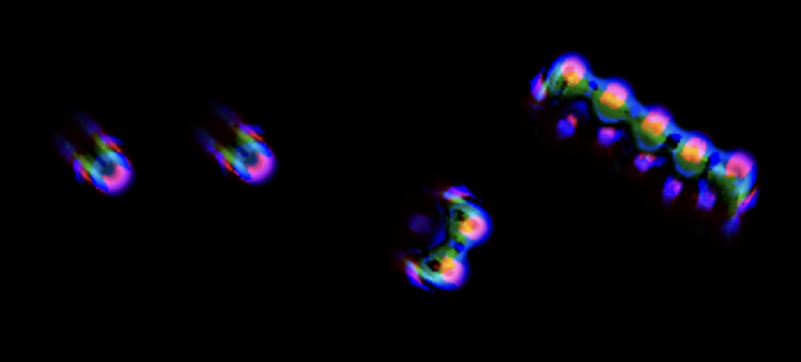
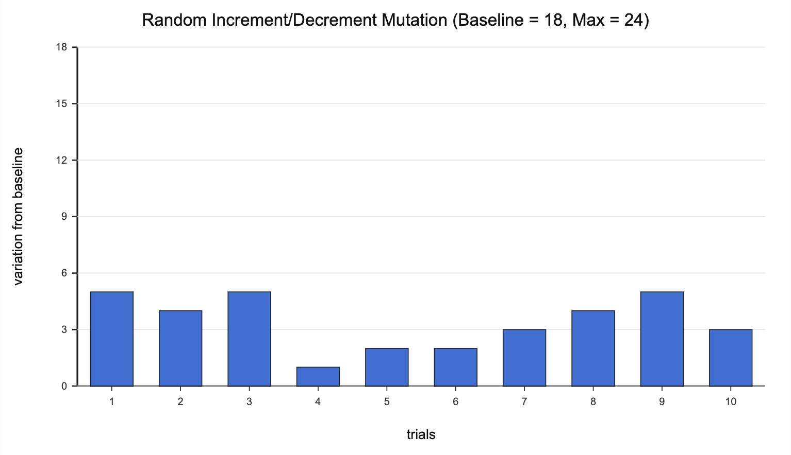
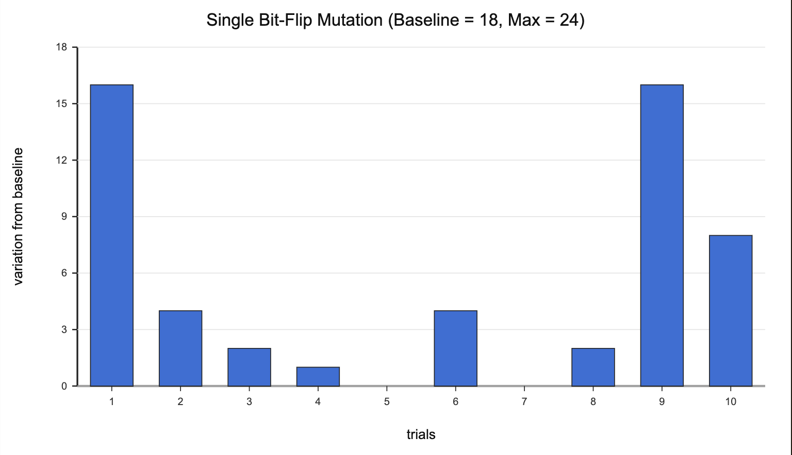

# Cross-Channel MNCA Discovery Tool



# Expansion + Design changes

See the [previous experiment](https://github.com/geckoberry/experiment-2) for a more in-depth explanation of SMNCA and the initial rule design for this tool. <br><br>
The new design uses the following parameters:
```
* 8 binary sequences (length 12) as neighborhoods, 1 signifies inclusion at radius i
* 32 thresholds / 16 rule pairs, value in [0, 1]
* 16 weights, value in [-0.075, 0.075]
* 16 channel triplets, values in [0, 1] normalized as RGB proportions
```
The initial change was expanding each neighborhood from a single annuli (radius1, radius2) to a set of annuli represented by a 12 length binary sequence, where a 1 indicates that the ith radius is included in the neighborhood. When generating a random neighborhood, we first take probability `p ~ U[0.0, 0.7]`. We then iterate through each 12 radii starting from radius 1 and apply a simple algorithm:<br>
```
if previous bit == 0 or null: 1 with chance p
elif previous bit == 1:       1 with change sqrt(p)
```
This way, we are more likely to cluster rings and create denser annuli, which I found to improve robustness.<br><br>
Another key change is the way we select a winning candidate. While initial trials scored candidates based on greatest total change to pixel value, I discovered that designating a winning candidate for each channel (using greatest change to that channel) also increased the average robustness of the system.

### Channel mixing

Naively, we can expand to 3 channels by tripling the number of rules such that we have a read and update sequence for each channel for all neighborhoods. However, an issue that arises with this method is that channels have no way of interacting with another, producing patterns that don't utilize the additional channels in any meaningful way. To address this, we decouple read channels from write channels and instead allow cross-channel mixing. This lets neighborhood reads combine information across channels and lets writes distribute updates across channels, creating genuinely multichannel dynamics rather than three parallel single-channel systems. We implement this by having two triplets (`[read_R, read_G, read_B]` and `[write_R, write_G, write_B]`) per rule. <br><br>
```
for each rule [(lo, hi), weight]:
  read_val = nbrhd_avg.R * read_R + nbrhd_avg.G * read_G + nbrhd_avg.B * read_B
  if lo < read_val < hi:
    pixel.R += weight * write_R
    pixel.G += weight * write_G
    pixel.B += weight * write_B

* Note: each channel triplet is normalized to sum to 1
```

# Evolutionary algorithm

With the single channel rulespace, we were able to get away with "spinning" for interesting patterns and making light adjustments to produce a desirable result. Adding two more channels dramatically expands the system’s expressive capacity, but it also greatly increases search complexity. In the multichannel setting, random rules are less robust on average, and desirable behaviors become much harder to discover by manual tuning alone. For multichannel MNCA, pattern evolution is therefore essential for effectively navigating the rulespace.

### Mutation quality

Previously, we were mutating patterns by incrementing/decrementing every parameter based on an adjustable strength. While the change to each parameter is random, this method still produces very uniform changes to the overall ruleset and constrains the degree of change due to using PRNGs as the random factor. The improved method instead mutates the raw byte representation of the ruleset, similar to how mutations occur in DNA. The user sets a bit-flip chance (replacing mutation strength), and each bit in the serialized ruleset is independently flipped with the given probability, producing subtle, dramatic, or even zero change depending on which bits flip. This makes exploration of pattern space much richer compared to simply nudging the parameters. However, a key caveat of this method is that strict parameter semantics are harder to enforce, and constraints can be violated after mutation due to the nature of bit flips . For example, channel triplets must be renormalized in the shader to restore valid channel proportions.
<table>
  <tr>
    <td align="center" width="25%">
      <br>
    </td>
    <td align="center" width="25%">
      <br>
    </td>
  <tr>
<table>

### Split screening

In order to make the evolutionary process more efficient, I implemented split-screening, which is a common technique in evolutionary simulations. Instead of evaluating one mutation at a time, split-screening presents multiple mutated variants in parallel, allowing for the user to quickly select promising descendants.


# Other features / experiments

### Pattern interactivity

Because MNCA solitons are often very stable, we can simulate interaction as shown below. The following examples are implemented similarly: by sampling a ring of pixels around the cursor and mixing their values into a ring that is closer or farther, we can "push" or "pull" pixels away from or towards the cursor. This visualizes attraction/avoidant responses from solitons.

https://github.com/user-attachments/assets/5f8faac3-45e9-465c-8783-711bcbe529f9

https://github.com/user-attachments/assets/dd6be26a-d408-43e9-b049-1efd011fa8d8

### Obstacles

https://github.com/user-attachments/assets/f53f19b6-f4f3-47f9-9b63-0cb84a2586a4


### Soundmapping

https://github.com/user-attachments/assets/c6f17c78-b6a8-405d-9c0f-e73a4bb18856
